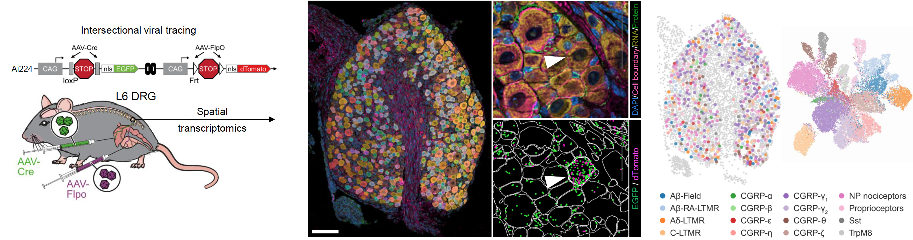

# DRG Xenium Spatial Transcriptomics Analysis

This repository contains code for processing, analysis, and visualization of Xenium spatial transcriptomics data from dorsal root ganglion (DRG) samples, with focus on colon and bladder innervation. 

---

## Data Availability

Raw spatial transcriptomics data generated using Xenium In Situ technology are available at GEO under accession number: **GSE316300**.

Single-cell RNA-seq reference datasets:
- **GSE139088** - DRG scRNA-seq ([https://www.ncbi.nlm.nih.gov/geo/query/acc.cgi?acc=GSE139088](https://www.ncbi.nlm.nih.gov/geo/query/acc.cgi?acc=GSE139088))
- **GSE254789** - DRG scRNA-seq ([https://www.ncbi.nlm.nih.gov/geo/query/acc.cgi?acc=GSE254789](https://www.ncbi.nlm.nih.gov/geo/query/acc.cgi?acc=GSE254789))

---

## Notebooks

All notebooks are organized in numbered order. Before running, configure file paths in [`config/paths.py`](./config/paths.py) and [`config/paths.R`](./config/paths.R) to match your computing environment.

| Subdirectory                    | Description                                                                                 |
|---------------------------------|---------------------------------------------------------------------------------------------|
| `00a_download-xenium`           | Download and organize raw Xenium output data from external sources                          |
| `00b_download_references`       | Process and prepare single-cell RNA-seq reference datasets (GSE139088, GSE254789)           |
| `01_pre-processing`             | QC filtering, normalization, and scVI integration of Xenium data                           |
| `02_cell-labels`                | Cell type annotation using reference mapping (ScanVI and Seurat)                            |
| `03_neurons`                    | Subclustering and refinement of neuronal populations                                       |
| `04_thresholds`                 | Determine reporter expression thresholds using Gaussian mixture models                     |
| `05_figures`                    | Data visualization and figure generation                                                   |
| `06_geo`                        | Prepare and format data for GEO submission                                                 |

---

## Computing Environments

Conda environment specifications are provided in the [`envs/`](./envs) directory. Each notebook specifies its required environment at the top. 

---

## Code Development

Analyses were developed by [@mncowan](https://github.com/mncowan) and finalized by [@kathleenabadie](https://github.com/kathleenabadie).

